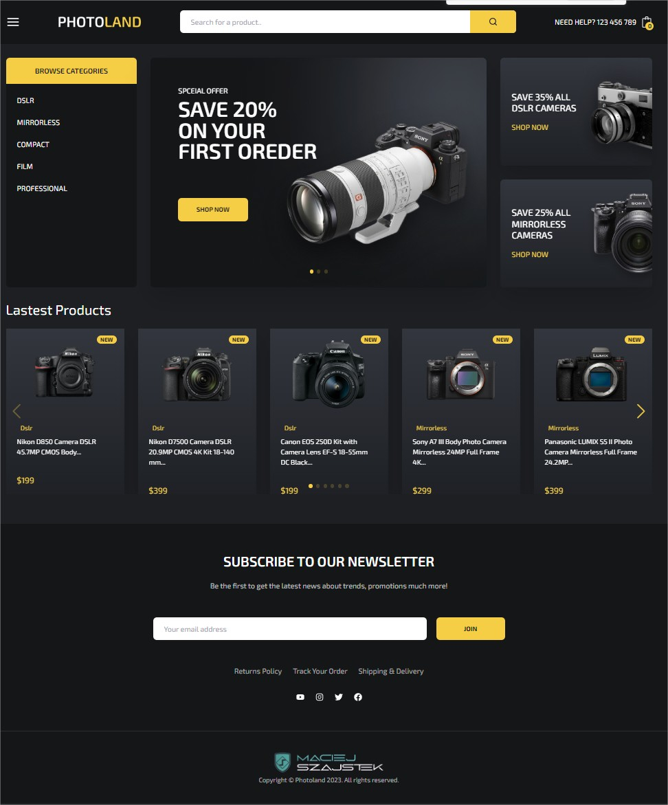
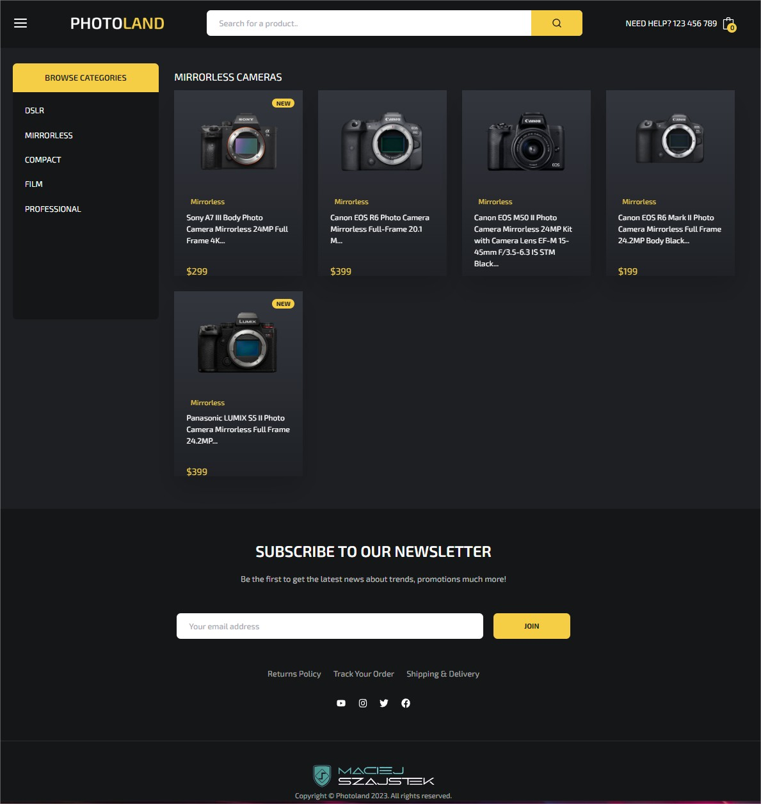
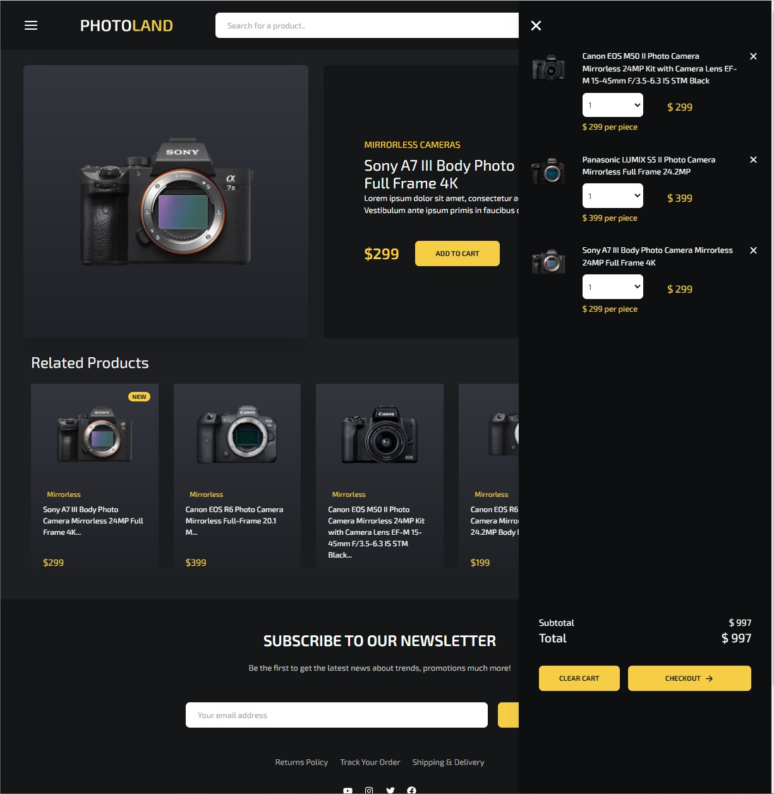
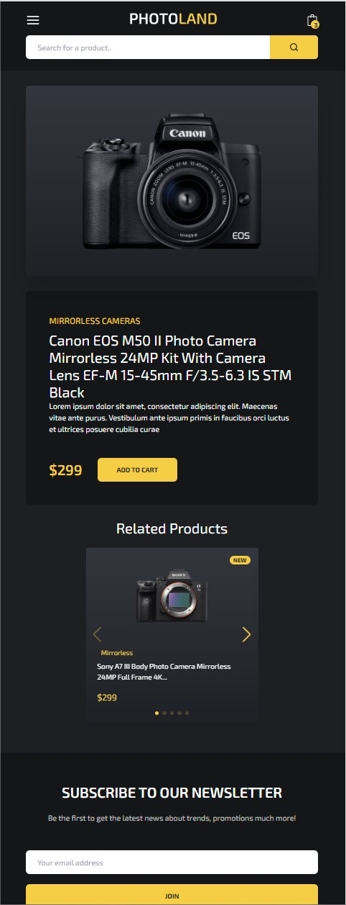
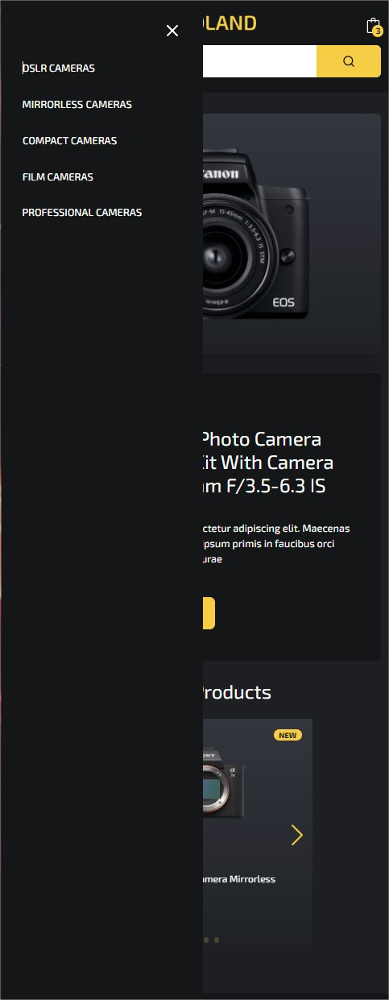
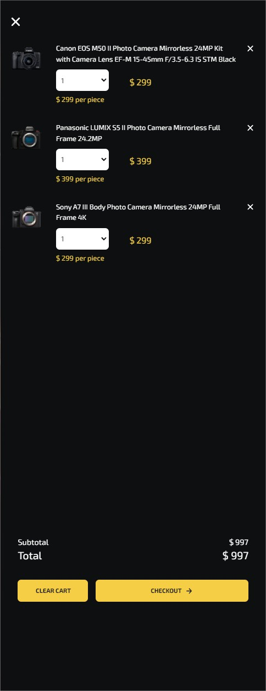

# Welcome to Photoland: Your Premier Destination for Photography Enthusiasts**

Photoland is your ultimate online hub for all things photography. We offer a diverse range of high-quality cameras, lenses, and accessories to cater to both amateur and professional photographers.

**Explore the Best:** Dive into our curated collection of cutting-edge DSLRs, mirrorless cameras, lenses, and more from top brands like Canon, Nikon, and Sony.

**Expert Guidance:** Our team of photography experts is here to provide personalized guidance, helping you choose the perfect gear for your unique style and preferences.

**Secure Shopping:** Shop with confidence knowing that Photoland offers secure payment options, reliable shipping, and a hassle-free return policy.

**Join Our Community:** Join a thriving community of photography enthusiasts, participate in discussions, share your work, and gain insights from fellow photographers to enhance your skills and creativity.

## Features

* Navigation on bar
* Cart
* DataBase
* Validations on formulas
* Search Bar
* Navigation searching
* Test payment on strape

## Technologies

* React Scroll
* React Switch
* Strapi
* Strape
* Tailwind css
* RWD
* Typescript
* React: react-router
* Data Typescript
* Custom hook
    - useState
    - useEffect
    - useContext
    - useParams
* Responsive design
* Props validations
* Animations

## Demo <a href = "https://atlon1.github.io/fotoSite/"> here --></a>

## Desktop

## Main section

 

## Selection section
  

## Cart section

## Mobile

## Main section

 

## Prerequisites
* Before getting started, make sure you have the Node.js and npm or yarn
* Clone this repository to your local machine
* Navigate to the project directory
* Install the project dependencies by running npm install or yarn install
* Start the development server npm start or yarn start
* Bash on folder Api to run strapi
* Open your browser and visit your localhost:3000 to see the running application.